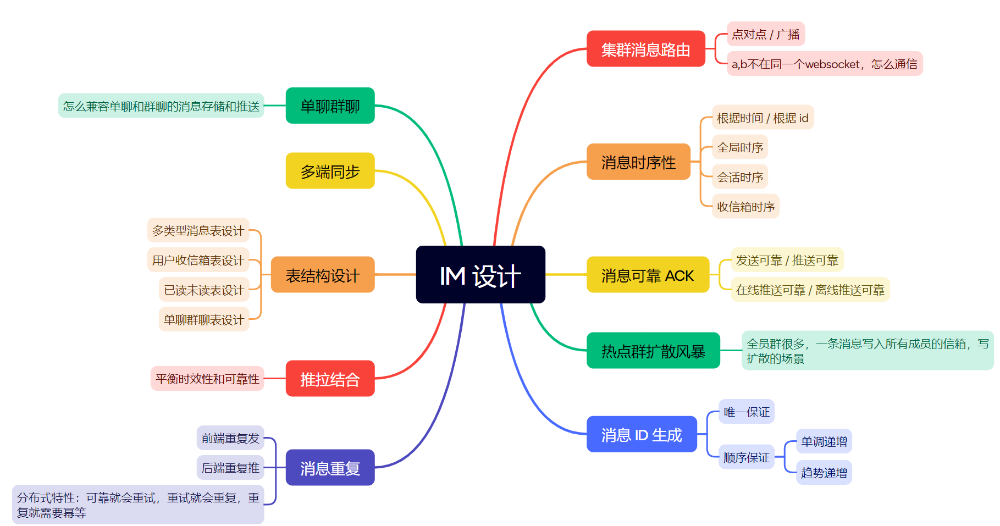

    

<h1 align="center">MallChat-抹茶</h1>

<strong>一个既能购物又能即时聊天的电商系统。致力于打造互联网企业级项目的最佳实践。 电商该有的购物车、订单、支付、推荐、搜索、拉新、促活、推送、物流、客服、它都必须有。</strong>

    
    
    <a href="https://github.com/zongzibinbin/MallChat/commits" target="_blank"> 
    
    
     
     
     

> [Fork 仓库原地址](https://github.com/zongzibinbin/MallChat)
> 
> **快速体验地址**：[抹茶聊天首页](https://mallchat.cn)

# 项目介绍
抹茶聊天是一个 IM 项目，通过 Netty 实现和前端的 Websocket 连接。内含微信扫描登录，成员列表，支持消息列表，消息互动，支持文字，语音，图片，文件多样化的聊天方式，还有很多实用的小功能比如离线消息推送，消息已读未读数统计等等，参考市面上成熟的 IM 产品如 QQ ，微信设计完成

## 技术选型
|        技术         | 说明                                       | 官网                                                         |
| :-----------------: | ------------------------------------------ | ------------------------------------------------------------ |
|     SpringBoot      | web开发必备框架                            | [https://spring.io/projects/spring-boot](https://spring.io/projects/spring-boot) |
|       MyBatis       | ORM框架                                    | http://www.mybatis.org/mybatis-3/zh/index.html               |
|     MyBatisPlus     | 零sql，简化数据库操作，分页插件            | [https://baomidou.com/](https://baomidou.com/)               |
|        Redis        | 缓存加速，多数据结构支持业务功能           | [https://redis.io](https://redis.io)                         |
|      Caffeine       | 本地缓存                                   | http://caffe.berkeleyvision.org/                             |
|        Nginx        | 负载均衡，https配置，websocket升级，ip频控 | [https://nginx.org](https://nginx.org)                       |
|       Docker        | 应用容器引擎                               | [https://www.docker.com](https://www.docker.com)             |
|         Oss         | 对象存储                                   | [https://letsencrypt.org/](https://letsencrypt.org/)         |
|         Jwt         | 用户登录，认证方案                         | [https://jwt.io](https://jwt.io)                             |
|       Lombok        | 简化代码                                   | [https://projectlombok.org](https://projectlombok.org)       |
|       Hutool        | Java工具类库                               | https://github.com/looly/hutool                              |
|     Swagger-UI      | API文档生成工具                            | https://github.com/swagger-api/swagger-ui                    |
| Hibernate-validator | 接口校验框架                               | [hibernate.org/validator/](hibernate.org/validator/)         |
|        minio        | 自建对象存储                               | https://github.com/minio/minio                               |

## 方案设计

## 亮点功能
- 游标翻页
- 万人群聊消息的推送
- 基于 Caffeine + Redis 的多级缓存框架
- 分布式场景下 IM 方案的选择
